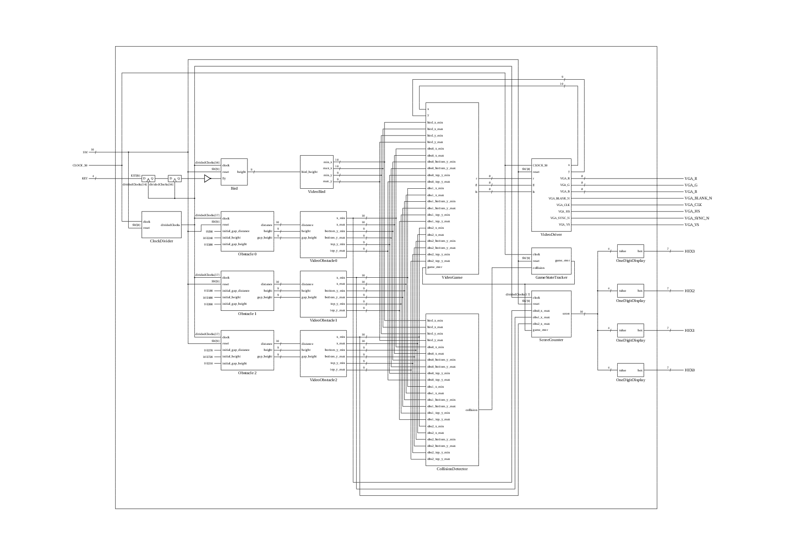

# EE 271 Lab 8 Final Project

## Flappy Bird

EE 271 is "Digital Circuits and Systems" at the University of Washington. The class covers logic gates and digital design, and has weekly labs to expose students to FPGAs and digital design in practice. For our final lab, we were given a choice of projects to build---I chose "Flappy Bird."

The game was designed for the Altera DE1 FPGA development board. A VGA monitor capable of displaying 640x480 is required to play the game. The VideoDriver module was provided by Professor Scott Hauck, but the rest of the code is my own. View a demo at https://www.youtube.com/watch?v=DOztI2MWZZ0.

### Features:

* "randomly" selected pipe gaps (using a nine-bit LFSR)
* scorekeeping on the built-in hex display

### Block Diagram:

